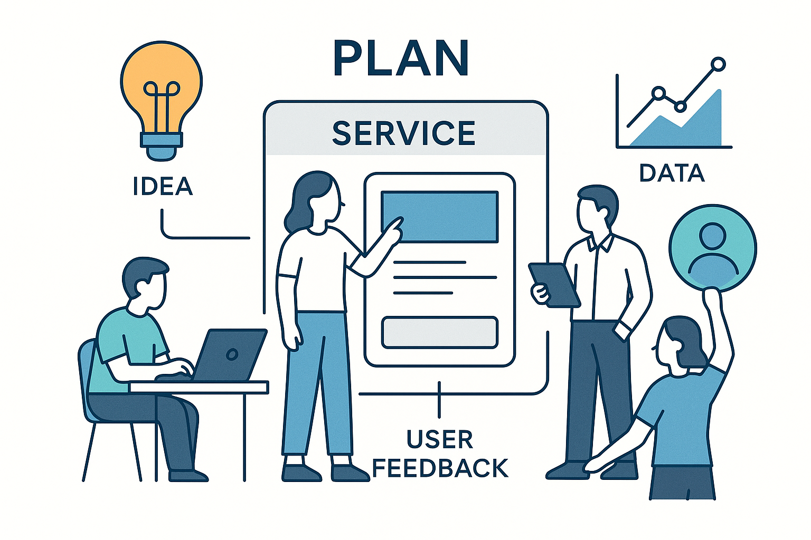

# 서비스 기획자를 위한 바이브 코딩

## 프로젝트 디렉토리 구조

### codes
- **[bootstrap:](./codes/bootstrap/)** Bootstrap 적용 디자인 실습
- **[skax-vibe-vue:](/codes/skax-vibe-vue/)** Vue 프로젝트 실습

### resources
- **[prompts](./resources/prompts/):** LLM 프롬프트 목록
- **[sample](./resources/sample/):** 서비스 예시

