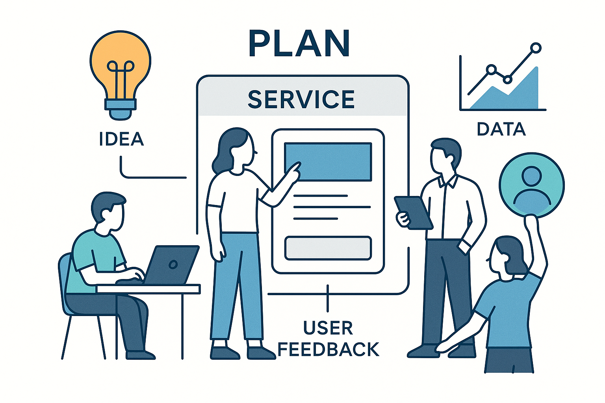

# 서비스 기획자를 위한 바이브 코딩

## 프로젝트 디렉토리 구조

### text
- **[files](./text/files/):** 교재 보충 정보
- **[prompts](./text/prompts/):** LLM 프롬프트 목록

### src
- **[bootstrap:](./src/bootstrap/)** Bootstrap 적용 디자인 실습
- **[skax-vibe-vue:](/src/skax-vibe-vue/)** Vue 프로젝트 실습

